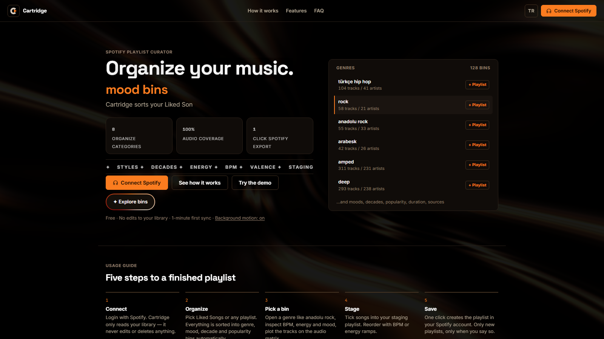
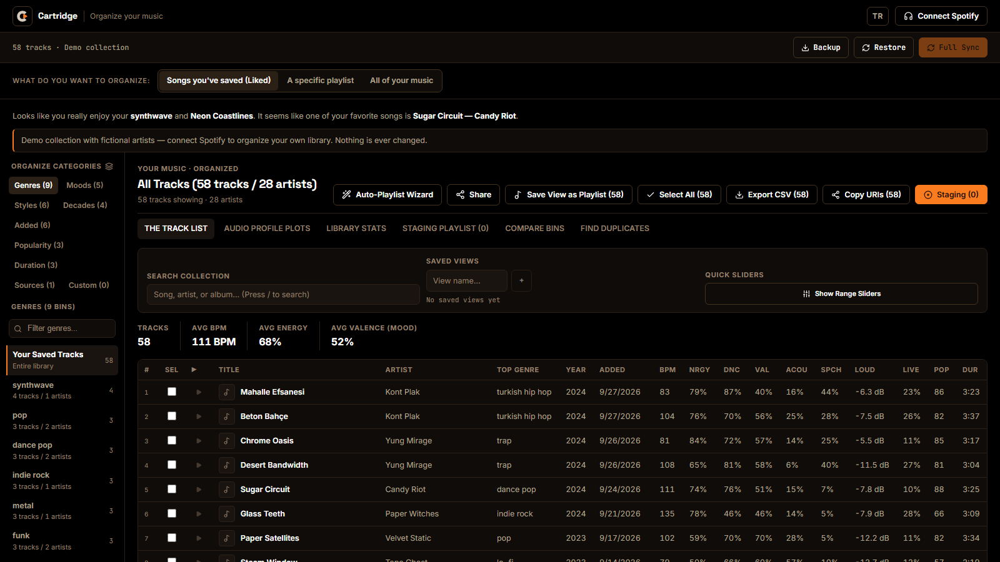
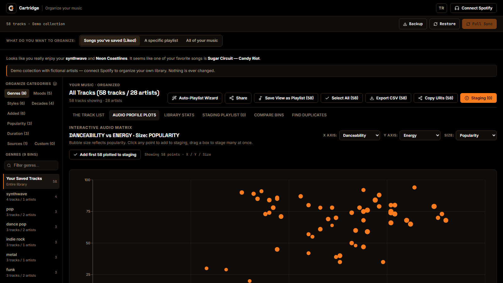
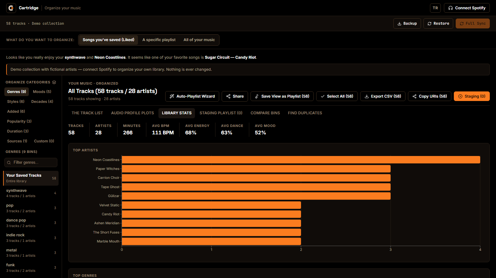

# Cartridge — Organize Your Music

<p align="center">
  
</p>

<p align="center">
  <strong>Get your music collection in order.</strong><br />
  Sync your Spotify library, browse it in genre, mood and decade bins, and turn any selection into a new playlist in one click.
</p>

<p align="center">
  Live demo: <a href="https://cartridge-music.pages.dev">cartridge-music.pages.dev</a><br />
  Try without login: <a href="https://cartridge-music.pages.dev/app?demo=1">Demo collection</a>
</p>

---

## Screenshots

| Landing | Studio |
|---|---|
|  |  |

| Plot | Stats |
|---|---|
|  |  |

To add screenshots: save PNG files with these exact names into `docs/screenshots/` (`landing.png`, `studio.png`, `plot.png`, `stats.png`), then commit and push. Recommended size is 1600x900.

---

## What it does

- Sync Liked Songs, a single playlist, or your full library (liked songs plus every owned and followed playlist, de-duplicated).
- Browse automatic bins: genre, mood, decade, energy, plus custom bins with your own rules.
- Filter and plot audio attributes. Drag a box on the plot to stage many tracks at once.
- Stage tracks, optimize DJ flow (BPM ramp, energy curve), compare two bins side by side, hunt duplicate releases.
- Save the result back to Spotify as a new playlist in one click.
- Track what is new since your last sync, keep saved views and snapshots, export and import backups.
- Works as a PWA: static shell works offline, Spotify data always loads fresh from the network.

## Quick start

You need Node 20 and a Spotify Client ID. No client secret is required, auth uses PKCE and runs fully client-side.

1. Go to the [Spotify Dashboard](https://developer.spotify.com/dashboard) and create an app.
2. Open Settings, add this Redirect URI, then press Save:
   `https://localhost:5173/callback`
3. Copy the Client ID.
4. Copy the env file and fill it in:

```sh
cp .env.example .env
```

Set in `.env`:

```sh
VITE_SPOTIFY_CLIENT_ID=your_client_id_here
VITE_SPOTIFY_REDIRECT_URI=https://localhost:5173/callback
```

5. Install and run:

```sh
npm install
npm run dev
```

6. Open `https://localhost:5173`. Your browser shows a one-time self-signed certificate warning, accept it to continue. Always use the `localhost` address, `127.0.0.1` is a different origin and breaks login.

Note: Spotify closed the `/audio-features` endpoint for newer apps. The app backfills missing audio attributes deterministically from genre profiles (`src/lib/oym/audioIntelligence.ts`).

## Scripts

- `npm run dev` — local dev server
- `npm run build` — typecheck plus production build
- `npm run lint` — oxlint
- `npm test` — vitest unit tests
- `npm run test:e2e` — Playwright specs in `e2e/` (demo mode, no login required)

## Routes

- `/` — landing page with hero, usage guide and FAQ
- `/app` — the studio (bins, table, plots, stats, staging, compare, duplicates)
- `/app?demo=1` — studio with a bundled fictional demo collection, no login required
- `/callback` — Spotify auth return
- Any other path renders the 404 page

## How it works

No backend. Spotify PKCE auth runs in the browser, tokens live in `localStorage`. Tracks are cached in IndexedDB via Dexie. Missing audio features are estimated by the Audio Intelligence engine so filtering, plotting and flow scoring always work.

## Project structure

- `src/App.tsx` — shell, sync, bins sidebar, table, staging, wizard
- `src/pages/` — Landing, Callback, NotFound
- `src/components/PlotView.tsx` — X/Y/Size scatter plot (click or drag a box to stage)
- `src/components/StatsView/` — library charts (artists, genres, decades)
- `src/components/DuplicatesView/` — duplicate-release hunter
- `src/components/CompareView/` — two-bin comparison
- `src/components/WhatsNew/` — new tracks since last sync
- `src/components/ShareCard/` — shareable playlist card
- `src/lib/spotify/` — PKCE auth plus API client and playback
- `src/lib/cache/` — Dexie database, sync, hydration, backup
- `src/lib/oym/` — bins, presets, audio estimates, duplicate detection
- `src/lib/demo/` — bundled fictional collection for `/app?demo=1`
- `src/lib/dj/` — DJ flow scoring and ordering
- `src/lib/studio/` — persist, custom bins, saved views, snapshots, clipboard
- `*.test.ts` next to sources — vitest unit tests

See `BRANDKIT.md` for colors, logo and copy rules. Playlist descriptions credit `Created with Cartridge — Organize Your Music`.
